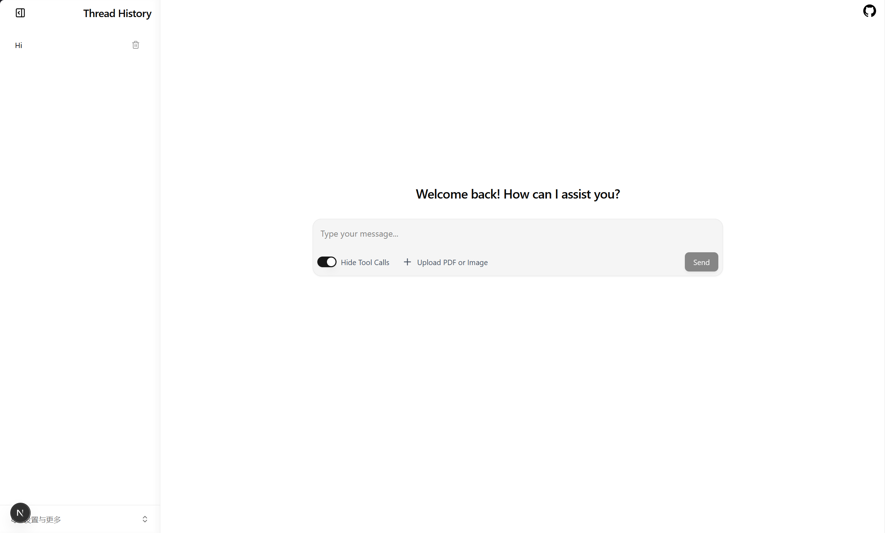

# ZHarness Next

English | [简体中文](README.zh-CN.md)

ZHarness Next is an agent runtime for AI-assisted coding. It uses LangGraph to
orchestrate agents and runs file operations and shell commands through a
configurable sandbox backend. Hardened per-thread Docker containers are the
default; a local filesystem backend is available for trusted local projects.

The project is still in an early stage of development. `zharness` contains the
main runtime capabilities, while `gateway` is currently a placeholder for a
future gateway layer.

## Frontend Preview



## Features

- A Lead Agent built with LangGraph and LangChain.
- A Next.js chat frontend based on LangChain Agent Chat UI.
- Reasoning and tool calling through MiMo, DeepSeek, OpenAI, or Anthropic chat models.
- Thread-scoped workspaces with a shared virtual path model across sandbox
  providers.
- Tools for directory listing, file reading and writing, exact edits, deletion,
  glob matching, and text search.
- DuckDuckGo web search that returns titles, URLs, and snippets with no API key
  required.
- Pluggable sandbox providers: hardened Docker containers by default, or a
  local filesystem sandbox (`sandbox.provider: local` in
  `zharness/config.yaml`) for trusted local projects.
- Shell approval is selectable per run: `allow_all` executes directly and is
  the default, while `require_approval` interrupts `execute_command` for an
  explicit approve/reject decision.
- Skill discovery: bundled `SKILL.md` packages are exposed through a read-only
  `/mnt/skills` mount and a deferred `describe_skill` tool that keeps the
  system prompt compact.
- Tool failures use stable error codes without exposing internal exception
  details. Only read-only tools are retried automatically; side-effecting file,
  command, knowledge, and memory writes are never repeated by retry middleware.
- PostgreSQL-backed checkpoint persistence with an idempotent setup and a
  managed Compose service for local development.
- Todo-based planning for multi-step tasks and automatic summarization of long
  conversations.
- Automatic thread titles: after the first complete exchange the agent writes a
  `title` into the thread state, derived locally from the first user message by
  default or generated by a dedicated `title.model_name` model.
- Long-term memory stored in PostgreSQL: facts are extracted automatically in a
  detached background task after each turn, filtered by a deterministic write
  gate, deduplicated, capacity-capped with a hybrid eviction score, and surfaced
  as hidden context plus the `memory_search`/`memory_add`/`memory_update`/
  `memory_delete` tools and a web management UI backed by `/memory*` HTTP
  endpoints.
- Thread-scoped RAG knowledge backed by pgvector and Alibaba
  `text-embedding-v4`, with configurable LangChain retrieval and hybrid
  dense/full-text fusion.
- Configurable idle/count-based Docker sandbox cleanup, full thread resource
  cleanup on deletion, and container removal during graceful shutdown.

## Repository Layout

```text
.
├── docker/
│   └── sandbox.Dockerfile    # Agent command-execution environment
├── gateway/                  # Placeholder for a future external gateway
├── frontend/                 # Next.js frontend based on Agent Chat UI
├── scripts/
│   ├── cleanup.py            # Remove sessions, workspaces, and sandboxes
│   ├── dev.sh                # Unified `make dev` startup/stop launcher
│   ├── server.sh             # Server and PostgreSQL lifecycle helpers
│   ├── smoke_server.py       # End-to-end server smoke test
│   └── trace_url.py          # Resolve the configured LangSmith project URL
├── skills/                   # Bundled SKILL.md packages (public)
├── zharness/                 # Agent, tools, workspace, and sandbox runtime
│   └── config.yaml           # Non-secret YAML configuration
├── langgraph.json            # LangGraph graph and HTTP application config
├── pyproject.toml            # uv workspace configuration
└── uv.lock                   # Locked Python dependencies
```

Runtime data (thread workspaces, server logs) lives under the configured
`home` directory (the `home` key in `zharness/config.yaml`, or
`ZHARNESS_HOME`), which defaults to `.zharness` in the current working
directory.

## How It Works

1. A client creates a LangGraph thread and sends a message to `lead_agent`.
2. The agent calls workspace tools or the command-execution tool as needed.
3. On the first file or command operation, the server selects the configured
   sandbox provider. Docker is used when `sandbox.provider` is `docker` or unset.
4. The Docker provider creates a container for the thread and mounts
   `<home>/workspaces/<thread_id>` at `/workspace`.
5. The local provider operates directly on the configured `sandbox.local.root`,
   when set, or on the thread workspace otherwise. A configured local root is
   shared by all threads.
6. Later operations reuse the same thread sandbox. Deleting a thread removes
   its Docker container and workspace, or its automatically managed local
   workspace; a shared local root is never deleted.

The `/` path exposed to agent tools is the current thread's virtual workspace
root, not the operating-system root. In the Docker provider it maps to
`/workspace`; in the local provider it maps to the configured host directory.
Installed skills are mounted read-only at `/mnt/skills` and are not part of the
user workspace.

## Sandbox Providers

| Capability | Docker (default) | Local |
| --- | --- | --- |
| Selection | `sandbox.provider: docker` or unset | `sandbox.provider: local` |
| Workspace | One host workspace mounted into one container per thread | `sandbox.local.root`, or one managed workspace per thread |
| File operations | Confined to `/workspace` in the container | Confined by validated paths to the selected host directory |
| Shell commands | Enabled inside the container | Disabled unless `sandbox.local.allow_host_bash: true` |
| Intended use | Default; production and shared environments | Single-user, trusted local development only |

The local provider is not a security boundary equivalent to Docker. Enabling
host bash gives the agent the permissions of the ZHarness server process.

## Requirements

- Python 3.13 or later
- [uv](https://docs.astral.sh/uv/)
- Node.js 20 or later and pnpm
- Nginx for the unified local development endpoint
- Docker Engine when using the default Docker sandbox
- An API key for your chosen model provider (MiMo, DeepSeek, OpenAI, or Anthropic)

Rootless Docker is recommended in production and shared environments. The
server process needs access to Docker Engine, but the Docker socket must not be
mounted inside agent sandboxes.

## Quick Start

### 1. Install dependencies

Run from the repository root:

```bash
uv sync --all-packages
```

### 2. Build the sandbox image (default Docker provider)

```bash
docker build -f docker/sandbox.Dockerfile -t zharness-sandbox:latest .
```

Skip this step only when using the local provider.

### 3. Configure the server

Non-secret settings live in `zharness/config.yaml`. Copy the committed
template `zharness/.env.example` to `zharness/.env` only for secrets. Define
at least the following:

```yaml
# zharness/config.yaml
model:
  name: mimo-v2.5
```

```dotenv
# zharness/.env (secrets only; never commit)
MIMO_API_KEY=your-api-key
LANGGRAPH_STRICT_MSGPACK=true
```

`langgraph.json` loads `zharness/.env` by default; `zharness/config.yaml` is
read by the Python runtime and by `scripts/server.sh`. A set environment
variable always overrides the matching YAML value, so temporary overrides
(such as `ZHARNESS_HOME`) can still be exported directly.

The server-wide `AsyncPostgresSaver` derives its connection URI from the managed
Compose settings in `zharness/config.yaml`. At startup, the server applies the
idempotent checkpoint migrations and keeps the connection open until shutdown.
`make start` and `make dev` automatically start the PostgreSQL service defined
in `docker-compose.yml` and wait for its health check before starting LangGraph.
The default Compose credentials can be configured with:

```yaml
# zharness/config.yaml
postgres:
  managed: true
  user: zharness
  database: zharness
  port: 5432
```

Keep the managed `postgres.password` in `zharness/.env`
(`ZHARNESS_POSTGRES_PASSWORD`) instead of the YAML file. Set
`postgres.managed: false` when using an externally managed database; an
explicit `ZHARNESS_POSTGRES_URI` is required then and overrides all managed
connection settings.
`make stop` stops the frontend, backend, and Compose container but retains the
database's named volume. Use `make backend-stop` to stop only the backend and
managed PostgreSQL. The database can also be managed independently with
`make postgres-start`, `make postgres-stop`, and `make postgres-logs`.

Use the same LangGraph `thread_id` on subsequent runs to resume its persisted
conversation state. Deleting a thread through the LangGraph API also deletes
its checkpoints. `make clean` does not delete rows from an external PostgreSQL
database; delete threads through the API or apply a separate database retention
policy.

The provider is selected by `model.provider` (or `ZHARNESS_MODEL_PROVIDER`) and
inferred from the model name when null: names starting with `mimo` use MiMo,
names starting with `claude` use Anthropic, names starting with `deepseek` use
DeepSeek, and everything else uses OpenAI. For example:

```yaml
# zharness/config.yaml
model:
  name: qwen3
  provider: openai
  openai_base_url: http://127.0.0.1:11434/v1
```

The full list of optional settings is in the
[Configuration Reference](zharness/docs/config-reference.md). Every key can be
overridden with its `ZHARNESS_*` (or `LANGSMITH_*`) environment variable; API
keys and `LANGSMITH_API_KEY` are always read from the environment (`.env`).

For trusted local development without Docker, set for example:

```yaml
# zharness/config.yaml
sandbox:
  provider: local
  local:
    root: /absolute/path/to/project
    # Optional and high trust: allow_host_bash: true
```

### 4. Start the development server and frontend

Install the frontend dependencies once:

```bash
pnpm --dir frontend install --frozen-lockfile
```

Start the backend and frontend together with one command:

```bash
make dev
```

`make up` is an alias for the same command. `make dev` pre-flights the service
ports and reclaims any held by another ZHarness checkout, then starts the
managed PostgreSQL, backend, frontend, and Nginx together. All services are
managed by this single command and log to `.zharness/logs/` (the backend also
writes `.zharness/server.log`). The command occupies the terminal and waits;
press `Ctrl+C` to stop everything, or run `make stop` from another terminal.

To start only the backend in the foreground, use:

```bash
make backend-dev
```

Use `make backend-start` to run only the backend in the background. The legacy
`make start` command remains an alias for `make backend-start`. Use `make logs`
to follow background backend logs, `make status` to inspect its state, and
`make backend-stop` to stop only it and managed PostgreSQL. `make stop` stops
the complete development stack, including the frontend and managed PostgreSQL.

The default backend address is `http://127.0.0.1:2024`. Nginx exposes the
complete development application at `http://localhost:2026`, proxies pages and
hot-reload traffic to the frontend at `http://127.0.0.1:3000`, and proxies
`/api/langgraph/*` to the backend. The frontend connection can be overridden in
`frontend/.env.local`. The backend bind address and port are configured with
`server.host` and `server.port` in `zharness/config.yaml`. When the Docker
sandbox provider is selected (the default), backend startup verifies that
Docker is installed, running, and accessible. The check times out after five
seconds if Docker is paused or unresponsive.

If Windows-to-WSL localhost forwarding is unavailable, use one of the network
gateway addresses printed by `make dev`, such as `http://10.255.255.254:2026`.
The frontend resolves `/api/langgraph` against the browser's current origin, so
the same configuration works through either the local or network gateway.

The startup banner also prints the LangSmith Studio URL for the running backend
and, when tracing is enabled, a direct link to the configured LangSmith
project's traces.

### 5. Run the smoke test

Keep the server running and execute this command in another terminal:

```bash
uv run python scripts/smoke_server.py
```

With the default provider, the script verifies workspace reads, file writes and
edits, Todo-based task planning, the approval interruption before `execute_command`
runs, and the workspace mount during Docker command execution.

### 6. Clean up runtime data

To remove local Agent Server metadata, managed per-thread workspaces, and
Docker sandbox containers, run the cleanup script from the repository root:

```bash
uv run --package zharness python scripts/cleanup.py --dry-run   # preview
make clean
```

You can limit what gets cleaned with `--sessions`, `--workspaces`, and
`--sandboxes`, add Python/lint caches with `--caches`, or also delete the sandbox
image with `--remove-image`. Use `--dry-run` to preview, and `-y` to skip the
confirmation prompt (required for non-interactive use). PostgreSQL checkpoints
are intentionally excluded; delete their threads through the API or clean the
database separately.

Run `make help` to list all project commands. Use `make clean-dry-run` to preview
the default cleanup through the Makefile.

## Development and Testing

```bash
# Run unit tests
uv run pytest zharness/tests

# Run lint checks
uv run ruff check .

# Validate the LangGraph configuration
uv run langgraph validate

# Run Docker integration tests
ZHARNESS_RUN_DOCKER_TESTS=1 uv run pytest zharness/tests/test_docker_integration.py
```

## Package Documentation

- [`zharness`](zharness/README.md): implementation details for the agent, tools,
  workspace, and sandbox providers.
- [`gateway`](gateway/README.md): current status and development guidance for the
  gateway package.

## Current Limitations

- The model factory supports MiMo, DeepSeek, OpenAI (including OpenAI-compatible
  endpoints), and Anthropic providers, selected with `model.provider` in
  `zharness/config.yaml` (or `ZHARNESS_MODEL_PROVIDER`).
- `execute_command` defaults to unattended execution. Clients can set
  `configurable.approval_strategy` to `require_approval` to require an explicit
  approve/reject decision for the run.
- Workspace file tools operate on UTF-8 text through the same sandbox as shell
  commands. Docker transfers default to a 16 MiB per-file limit; local file
  operations default to 256 KiB.
- Shell commands may run for at most 300 seconds, with retained output limited
  to 1 MiB by default.
- Docker sandboxes have network access through the host bridge, but the root
  filesystem is read-only, so runtime dependencies must be installed into
  `/workspace` or baked into the sandbox image.
- Skills are mounted read-only at `/mnt/skills`; the agent can read them but
  never writes into that namespace.
- Long-term memory requires the same PostgreSQL database as checkpointing.
  Extraction is queued as a process-local background task per thread after each
  completed turn, so it never blocks the returned turn; queued snapshots are
  coalesced and each has a 60-second budget, and shutdown drains the queue for up
  to five seconds before cancelling. A dedicated `memory.extraction_model` or
  disabling extraction keeps token cost predictable.
- The local sandbox provider is intended for single-user, trusted local
  environments only. Host bash execution is disabled unless
  `sandbox.local.allow_host_bash` is `true`, and enabling it runs commands
  with the ZHarness server process's host permissions.
- `gateway` does not yet implement authentication, forwarding, or business APIs.
